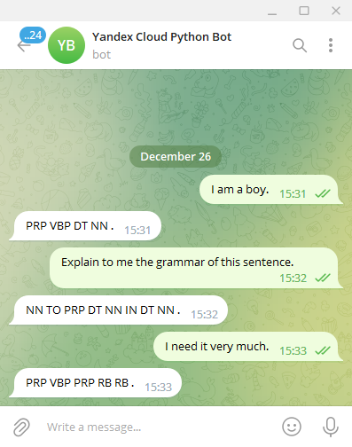

# telegram_bot_python_nltk

Yandex cloud serverless functions.

The telegram bot that returns the grammatical mask of a given sentence.

### How to try?

If you want to try it, write directly to [@YandexCloudPythonBot](https://t.me/YandexCloudPythonBot)

### How to use?

You'll need to create YC serveless function, api-gate and telegream bot.

### Originator

| contacts        | Stepan Solovey |
| ------------- |-------------:| 
| email:      | st.solovey@gmail.com |
| telegram:      | [t.me/duckever](https://t.me/duckever)      |   
